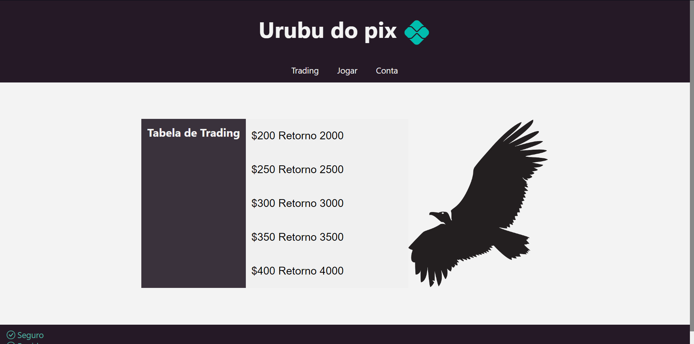

# Urubu do pix Django🦅



### Sobre o projeto ✨

> Projeto Django ensinando de maneira totalmente mediocre como você criar um urubu do pix

## Requisitos 💻

Antes de você baixar o projeto recomendo ter os seguintes requisitos

-   Precisa ter o `Python 3+` instalado.
-   Recomendado `GIT` clone ou post projeto.
-   Você precisa ter uma maquina `Windows, Linux or Mac`.
-   Recomendado ter conhecimentos basicos em `Python + DJango`.

## Como instalar 🚀

Linux & macOS

```
git clone https://github.com/danielBRTanimacao/desafio-spotter-django-rest.git

python3 -m venv venv
source venv/bin/activate
pip install -r requirements.txt
python manage.py runserver
```

Windows

```
git clone https://github.com/danielBRTanimacao/desafio-spotter-django-rest.git

python -m venv venv
venv/scripts/activate
pip install -r requirements.txt
python manage.py runserver
```
